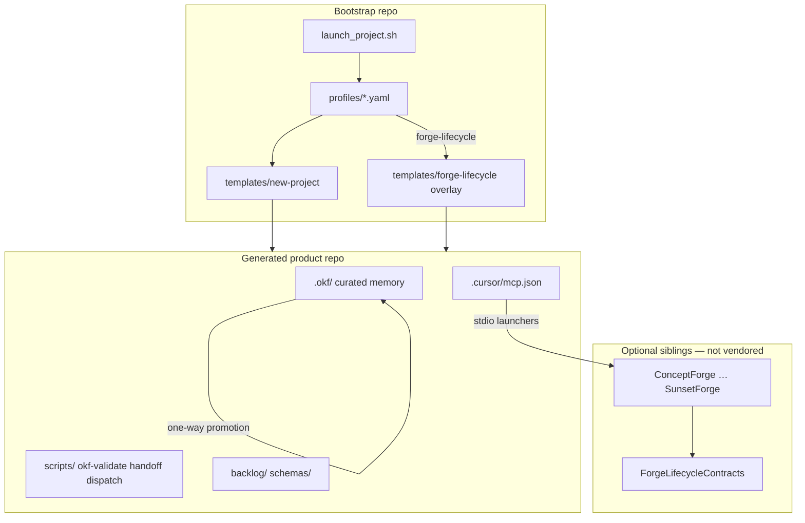

# Bootstrap Launcher Toolkit

Deterministic scaffolding for software projects that use **AI agents as first-class operators**. This repository is the reusable launcher: it generates a product repo with OKF project context, optional GitHub setup, MCP integration hooks, backlog contracts, and—when you need it—the **Forge lifecycle MCP portfolio** layered on top.

Validated patterns come from real integration work in the [Project-1 harness](https://github.com/nicksinx/Project-1) and are promoted here so every new product does not reinvent wiring, launchers, or operator docs.

---

## What you get

| Capability | Description |
|------------|-------------|
| **Deterministic scaffold** | Versioned templates, JSON schemas, and profile contracts—same inputs produce the same tree |
| **OKF bundle** | `.okf/` curated memory: requirements, decisions, workflows, handoffs, risks, improvements |
| **Optional task MCP** (`default` profile only) | Wrapper scripts for [cursor-ai-task-mcp-server](https://github.com/nicksinx/cursor-ai-task-mcp-server-updated)—a **separate** backlog/task orchestrator, not part of Forge |
| **Agent adapters** | Thin `AGENTS.md`, `CLAUDE.md`, Cursor rules—pointing at OKF, not duplicating it |
| **Forge lifecycle overlay** | Optional profile: sibling-clone layout, eleven Forge MCP launchers, integration docs |

Bootstrap **generates** product repositories. It does not run your application, vend Forge server code, or replace OKF as the source of curated project truth.

---

## How it works



1. **Choose a profile** (`default` or `forge-lifecycle`) — see [`profiles/`](profiles/).
2. **Run** [`scripts/launch_project.sh`](scripts/launch_project.sh) with `--name`, `--target-dir`, and flags.
3. **Render** Go templates from [`templates/new-project/`](templates/new-project/) (plus forge overlay when applicable).
4. **Validate** with `make check` in bootstrap, then `scripts/okf-validate` in the new project.
5. **Augment** by editing OKF concepts, enabling MCP servers, and (optionally) cloning Forge siblings.

Profiles extend each other: `forge-lifecycle` **extends** `default` and adds only the files listed in [`profiles/forge-lifecycle.yaml`](profiles/forge-lifecycle.yaml).

---

## Two MCP tracks (do not conflate)

Bootstrap supports **two independent MCP integration paths**. They share OKF as curated memory but use different servers and delivery models.

| Track | MCP server(s) | Delivery / orchestration | Used by |
|-------|---------------|--------------------------|---------|
| **Task orchestrator** (legacy bootstrap path) | [cursor-ai-task-mcp-server-updated](https://github.com/nicksinx/cursor-ai-task-mcp-server-updated) (`ai-task-orchestrator`) | Backlog import/sync, task claim/approve, `scripts/mcp/*` workers | `default` profile when you pass `--with-mcp` |
| **OKF + Forge** (harness-validated path) | `nicksinx/*Forge` + optional ForgeRelay | Lifecycle planning via Forge; implementation via `scripts/okf-dispatch`; continuity via ForgeRelay | `forge-lifecycle` profile; [Project-1](https://github.com/nicksinx/Project-1) |

**Project-1 does not use the ai-task MCP server.** The OKF + Forge way of working documented in the harness relies on OKF dispatch, Forge lifecycle MCPs, and ForgeRelay—not `ai-task-orchestrator`.

The bootstrap repo predates the Forge portfolio: its original GitHub description targeted the ai-task server. OKF was layered on as shared context; Forge was added as a **profile overlay**. Generated `forge-lifecycle` projects copy **Forge** MCP config into `.cursor/mcp.json`, not the ai-task server (though `scripts/mcp/` wrappers from `default` remain on disk unless you remove them).

---

## Profiles

| Profile | Use when |
|---------|----------|
| **`default`** | OKF product scaffold with backlog/schemas; **optionally** wire the ai-task MCP server (`--with-mcp`) for task-queue orchestration |
| **`forge-lifecycle`** | OKF + Forge lifecycle MCPs, sibling-clone helper, Option C integration docs—uses **Forge** MCP config, not ai-task |

---

## Prerequisites

- `bash`
- `python3` with `pyyaml` and `jsonschema`
- `git`
- **Optional:** `gh` for `--with-github`
- **Forge profile:** `node` ≥ 20 and built sibling Forge repos (see below)

---

## Quick start — default (OKF scaffold)

Scaffolds OKF, backlog, and validation. Does **not** enable any MCP server unless you opt in.

```bash
git clone https://github.com/nicksinx/bootstrap.git
cd bootstrap
make check

./scripts/launch_project.sh \
  --name my-product \
  --profile default \
  --target-dir ./out/my-product \
  --non-interactive

cd ./out/my-product
scripts/okf-validate
```

**Optional — ai-task MCP (separate from Forge):** add `--with-mcp --with-mcp-config` and install [cursor-ai-task-mcp-server-updated](https://github.com/nicksinx/cursor-ai-task-mcp-server-updated) so `scripts/mcp/register_project.sh` can reach it.

For the five-service OKF operator model (Cursor → Codex → Claude → Xcode → Perplexity) and `scripts/okf-dispatch`, copy patterns from [Project-1](https://github.com/nicksinx/Project-1)—they are not fully wired in the `default` profile alone.

---

## Quick start — OKF + Forge MCP

Use this when the product needs lifecycle planning across concept, build, launch, operate, learning, governance, and sunset—with **signed packets** between Forge servers and **review-gated promotion** into OKF.

```bash
./scripts/launch_project.sh \
  --name my-product \
  --profile forge-lifecycle \
  --target-dir ./out/my-product \
  --non-interactive

cd ./out/my-product

# Clone Forge repos as peers (../ConceptForge, ../BuildForge, …)
scripts/forge-clone-siblings.sh

# Build each sibling
for repo in ForgeLifecycleContracts ForgeRelay ConceptForge GovernanceForge \
  BuildForge LaunchForge OperateForge CustomerForge GrowthForge RevenueForge \
  InsightForge SunsetForge; do
  (cd "../$repo" && npm ci && npm run build)
done

# Enable Cursor MCP (example config → gitignored mcp.json)
cp .cursor/mcp-forge-lifecycle.json.example .cursor/mcp.json
# Reload Cursor MCP panel

scripts/okf-validate
```

Operator guide in the generated project: `docs/forge-lifecycle-integration.md`.

---

## OKF augmentation

**Open Knowledge Format (OKF)** is the Git-native curated memory layer every scaffolded project shares.

| Concern | Where it lives |
|---------|----------------|
| Navigation | `.okf/index.md`, `.okf/project.md` |
| Requirements & features | `.okf/requirements/`, `.okf/features/` |
| Decisions & risks | `.okf/decisions/`, `.okf/risks/` |
| Agent continuity | `.okf/handoffs/` |
| Lessons learned | `.okf/improvements/` |
| Validation | `scripts/okf-validate`, `scripts/okf-handoff`, `scripts/okf-context-pack` |

**Reading order for any agent:** index → project → task-relevant concepts → recent handoffs → improvements.

OKF explains and links to code, tests, and backlog—it does not replace them. Material changes should append to `.okf/log.md` and trace to a requirement, decision, or handoff.

To extend OKF on a generated project:

1. Add concepts under `.okf/` using your agent’s OKF skill or `scripts/okf-handoff`.
2. Run `scripts/okf-validate` before and after substantive edits.
3. Promote lessons from `.okf/improvements/` back into **bootstrap templates** when they apply to *all* future projects (see [Continuous improvement](#continuous-improvement)).

---

## Forge MCP augmentation

The **Forge portfolio** (`nicksinx/*Forge`) provides one MCP server per lifecycle stage. Shared contracts live in [ForgeLifecycleContracts](https://github.com/nicksinx/ForgeLifecycleContracts). [ForgeRelay](https://github.com/nicksinx/ForgeRelay) handles cross-tool session continuity—orthogonal to OKF dispatch.

### Option C integration (default policy)

Scaffolded `forge-lifecycle` projects inherit **Option C**:

| Layer | Role |
|-------|------|
| **OKF** | Curated memory substrate—requirements, decisions, handoffs |
| **Forge MCP** | Lifecycle planning engine—typed workspaces, signed envelopes, stage gates |
| **Promotion** | One-way, integrator-reviewed: Forge workspace → `.okf/` concepts |
| **OKF dispatch** | Implementation delivery pipeline (when installed on the product) |
| **ForgeRelay** | Tool-switch / session resume—not a replacement for dispatch or governance |

Forge is **not** a sixth OKF bootstrap service. Enable it **after** the five-service OKF setup.

Decision record (generated): `.okf/decisions/0002-okf-forge-integration.md`.

### Sibling layout (no vendoring)

Forge repos clone as **peers** of the product project:

```text
parent/
├── my-product/          ← generated repo (this toolkit)
├── ConceptForge/
├── BuildForge/
├── LaunchForge/
├── …
└── ForgeLifecycleContracts/
```

Launchers in `scripts/*-mcp.sh` resolve `../<Repo>`, pin versions, set `FORGE_WORKSPACE` under `.okf/forge/<stage>/` (gitignored), and assert contracts alignment.

### Lifecycle spine (conceptual)

```text
ConceptForge → BuildForge → LaunchForge → OperateForge
                    ↓              ↓
              GovernanceForge   Customer / Growth / Revenue (parallel)
                    ↓
              InsightForge (learning, iteration)
                    ↓
              SunsetForge → GovernanceForge + InsightForge (retirement closure)
```

Packet routing and OKF ingest targets: `.okf/references/forge-packet-type-registry.md`.

### What bootstrap includes vs the full harness

| In bootstrap (`forge-lifecycle`) | In [Project-1 harness](https://github.com/nicksinx/Project-1) |
|----------------------------------|------------------------------------------------------------------|
| MCP launchers, clone helper, slim integration doc | Full integration spec (`docs/okf-forge-integration-spec.md`) |
| Decision 0002, sibling layout, packet registry | Per-server agent guides (`.okf/agents/*forge*.md`) |
| Operator notes, promotion checklist **stub** | Full promotion checklists (`.okf/workflows/forge-*-checklist.md`) |
| Profile + smoke test | Vertical-slice evidence (`.okf/tests/*-evidence.md`) |

When you need promotion checklists, adversarial prompts, or E2E proof paths, link to or copy from Project-1—then promote stable patterns back into bootstrap templates.

Durable lessons from harness → bootstrap promotion: [`.okf/improvements/forge-lifecycle-bootstrap-lessons.md`](.okf/improvements/forge-lifecycle-bootstrap-lessons.md).

---

## Launch script reference

```bash
./scripts/launch_project.sh \
  --name <project-id> \
  --profile default|forge-lifecycle \
  --target-dir <path> \
  [--non-interactive] \
  [--dry-run] \
  [--force] \
  [--with-github] \
  [--with-mcp] \
  [--with-forge-mcp-config]
```

| Flag | Purpose |
|------|---------|
| `--dry-run` | Print actions without writing |
| `--with-github` | Create remote via `gh` (optional) |
| `--with-mcp` | Register project with **ai-task** MCP (not Forge)—requires separate server install |
| `--with-mcp-config` | Write ai-task `.cursor/mcp.json` (gitignored) |
| `--with-forge-mcp-config` | Copy Forge MCP example into `.cursor/mcp.json` |

Full flag list: `./scripts/launch_project.sh --help`.

---

## Repository layout

| Path | Purpose |
|------|---------|
| [`scripts/`](scripts/) | `launch_project.sh`, validation, GitHub helpers, worker dispatch |
| [`templates/new-project/`](templates/new-project/) | Base scaffold (`.tmpl` Go templates) |
| [`templates/forge-lifecycle/`](templates/forge-lifecycle/) | Profile overlay only |
| [`profiles/`](profiles/) | `default.yaml`, `forge-lifecycle.yaml` |
| [`schemas/`](schemas/) | JSON Schema contracts for backlog, handoffs, OKF concepts |
| [`skills/`](skills/) | Canonical OKF skill definitions (synced to generated projects) |
| [`tests/`](tests/) | Contract tests and launch smoke (including forge-lifecycle) |
| [`.okf/improvements/`](.okf/improvements/) | Bootstrap’s own lessons—source for template promotion |

---

## Development

```bash
make test-contracts    # JSON schema + profile contracts
make test-launch-smoke # End-to-end launch into temp dir
make check             # Both
```

Forge-lifecycle smoke: `tests/test_launch_smoke.py` validates profile render + `okf-validate` on output.

---

## Continuous improvement

1. **Product project** discovers a repeatable pattern → record in `.okf/improvements/`.
2. **Integration harness** (Project-1) proves it with tests and operator checklists.
3. **Bootstrap** absorbs stable, generic parts into `templates/` or `profiles/`.
4. **Forge repos** ship MCP behavior and contracts independently.

Do not copy harness-only material (full spec, adversarial dossiers, vertical-slice evidence) into bootstrap until it applies to every new product.

---

## Security notes

- Never commit Forge **signing keys**, approval receipts, or workspace PII.
- Forge runtime state belongs under `.okf/forge/` (gitignored).
- OKF promoted concepts are reviewed Markdown—not a secrets store.

Signing key layout: see Project-1 `.okf/references/forge-signing-keys-operator-runbook.md` when operating Forge in production.

---

## Related repositories

| Repository | Role |
|------------|------|
| [nicksinx/bootstrap](https://github.com/nicksinx/bootstrap) | This toolkit |
| [nicksinx/Project-1](https://github.com/nicksinx/Project-1) | OKF + Forge integration harness (full policy & evidence) |
| [nicksinx/ForgeLifecycleContracts](https://github.com/nicksinx/ForgeLifecycleContracts) | Shared envelopes, signing, compatibility boundaries |
| [nicksinx/ForgeRelay](https://github.com/nicksinx/ForgeRelay) | Cross-tool agent continuity (INT-001) |
| [nicksinx/ConceptForge](https://github.com/nicksinx/ConceptForge) … [SunsetForge](https://github.com/nicksinx/SunsetForge) | Lifecycle stage MCP servers (`forge-lifecycle` profile) |
| [cursor-ai-task-mcp-server-updated](https://github.com/nicksinx/cursor-ai-task-mcp-server-updated) | **Optional** task/backlog MCP for `default` profile only—not used by Project-1 or Forge |

---

## License & support

Bootstrap is an operator toolkit maintained for the `nicksinx` Forge + OKF ecosystem. For integration policy and phase status, treat [Project-1](https://github.com/nicksinx/Project-1) `docs/okf-forge-integration-spec.md` as the authoritative harness spec; treat this README as the entry point for **starting a new product** with the right profile and augmentation path.
