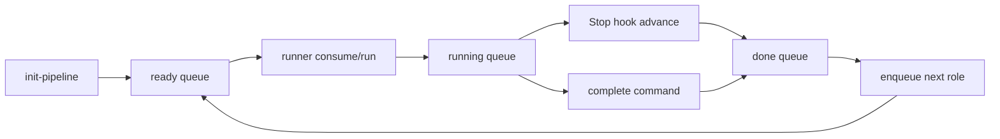

# OKF Dispatch Orchestration

Project-1 uses a file-queue dispatch system so Codex, Claude Code, Cursor, and Xcode-connected Claude Agent can hand work to each other without direct service calls.

## Principles

1. **Hooks enqueue work.** Lifecycle hooks (for example Codex `Stop`) call `scripts/okf-dispatch advance` to complete running packets and enqueue the next pipeline role.
2. **Runners consume work.** Each tool pulls typed JSON packets from `.okf/dispatch/ready/` when it is ready to execute.
3. **No direct cross-service calls.** Agents do not invoke each other. They read and write queue files under `.okf/dispatch/`.
4. **OKF stays the source of truth.** Packets reference OKF concepts; durable outcomes still belong in `.okf/`, handoffs, and `.okf/log.md`.

## Queue layout

```text
.okf/dispatch/
  ready/       ← work waiting for a runner
  running/     ← work claimed by a runner
  done/        ← completed packets
  failed/      ← failed packets
  pipelines/   ← pipeline manifests
```

## Roles

| Role | Typical responsibility |
|------|------------------------|
| `builder` | Implement or change project artifacts |
| `tester` | Run tests and capture evidence |
| `reviewer` | Review changes against OKF requirements |
| `integrator` | Merge outcomes, update OKF, finalize handoff |

Default runner mapping:

| Role | Default runner |
|------|----------------|
| `builder` | `codex` |
| `tester` | `claude` |
| `reviewer` | `cursor` |
| `integrator` | `codex` |

Override at pipeline start with `--runners builder:codex,tester:claude,reviewer:cursor,integrator:claude`.

## Work packet schema

Each packet is a JSON file in one queue directory.

```json
{
  "schema_version": 1,
  "packet_id": "builder-a1b2c3d4",
  "pipeline_id": "pipe-e5f6g7h8",
  "role": "builder",
  "runner": "codex",
  "status": "ready",
  "source": "pipeline",
  "prompt": "You are the builder in an OKF multi-agent delivery pipeline.\n...",
  "context": {
    "okf_paths": [".okf/index.md", ".okf/project.md"],
    "overflow": null
  },
  "depends_on": [],
  "created_at": "2026-06-27T12:00:00+01:00",
  "updated_at": "2026-06-27T12:00:00+01:00",
  "result": null
}
```

Supported runners:

- `codex` — executed with `codex exec`
- `claude` — executed with `claude -p`
- `cursor` — project-local packet consumer; agent reads the packet from the queue
- `xcode-claude` — Xcode-connected Claude Agent reads the packet locally

## Commands

Start a pipeline:

```bash
scripts/okf-dispatch init-pipeline "Add OKF dispatch orchestration" \
  --runners builder:codex,tester:claude,reviewer:cursor,integrator:codex
```

Enqueue ad hoc work:

```bash
scripts/okf-dispatch enqueue --role tester --runner claude --prompt "Run validation suite"
```

Consume the next packet for a runner:

```bash
scripts/okf-dispatch consume --runner cursor
```

Run a packet end to end (consume, execute, complete, advance):

```bash
scripts/okf-dispatch run --runner codex
scripts/okf-dispatch run --runner claude
```

For Cursor and Xcode-connected Claude Agent, `run` prints the packet JSON and completion instructions instead of invoking an external CLI.

Mark completion manually:

```bash
scripts/okf-dispatch complete --packet-id builder-a1b2c3d4 --from cursor
```

Inspect queues:

```bash
scripts/okf-dispatch status --verbose
scripts/okf-dispatch show --packet-id builder-a1b2c3d4
```

Advance after an interactive session:

```bash
scripts/okf-dispatch advance --from codex
```

## Perplexity overflow failover

When a primary runner hits usage limits or is unavailable, record overflow metadata and create a handoff for Perplexity MODE B:

```bash
scripts/okf-dispatch overflow --packet-id builder-a1b2c3d4 \
  --reason usage_limit \
  --primary-runner codex \
  --overflow-model best
```

This command:

1. Adds `context.overflow` to the packet (`execution_mode`, `primary_runner`, `failover_reason`, `role`, etc.)
2. Writes `.okf/handoffs/YYYY-MM-DD-overflow-<packet-id>.md` by default
3. Prints JSON with next steps for Perplexity and the integrator (Cursor/Codex)

Perplexity does not consume dispatch JSON directly. The integrator applies overflow output and then completes or fails the packet manually.

See `.okf/workflows/perplexity-overflow-failover.md`.

## Codex Stop hook

Project-local Codex hooks live in `.codex/hooks.json`. The `Stop` hook calls:

```bash
scripts/okf-dispatch advance --from codex
```

When Codex pipes hook input on stdin, `advance` returns valid Stop-hook JSON:

- `{"continue": true}` when no Codex work remains
- `{"decision": "block", "reason": "<next prompt>"}` when the next ready packet targets Codex

This keeps Codex sessions alive across pipeline roles without Codex calling Claude or Cursor directly.

## Cursor consumption model

Cursor is a project-local packet consumer unless you configure an explicit Cursor CLI or hook integration.

Typical flow in Cursor:

1. Run `scripts/okf-dispatch status --verbose` or `consume --runner cursor`.
2. Open the packet JSON and follow the prompt.
3. Complete OKF updates and run `scripts/okf-dispatch complete --packet-id ... --from cursor`.

Optional future enhancement: add `.cursor/hooks.json` with a `stop` hook that mirrors the Codex pattern.

## Role handoff expectations

Each role produces a handoff before advancing to the next stage. Use the template from `.okf/handoffs/` that matches the role.

### Tester (default runner: `claude`)

After completing the `tester` packet, Claude Code should write a handoff at `.okf/handoffs/YYYY-MM-DD-tester-<slug>.md` using `TEMPLATE-tester.md` before the reviewer consumes their packet.

Required content:

- **Tests run** — table of commands with PASS/FAIL/SKIP per row
- **Evidence path** — link to `.okf/tests/` document if created
- **Issues for reviewer** — gaps, skipped areas, or failures the reviewer must see
- **Next actions** — explicit reviewer steps (consume packet, check evidence, complete)

The tester packet prompt will specify `--from claude` as the completion flag:

```bash
scripts/okf-dispatch complete --packet-id <tester-id> --from claude
python3 scripts/okf-dispatch advance --from claude   # manual; no Stop hook on Claude Code
```

If blocked, trigger overflow before the handoff:

```bash
scripts/okf-dispatch overflow --packet-id <id> --reason usage_limit --primary-runner claude
```

The overflow command writes a handoff stub automatically. Fill in any missing evidence and context before starting Perplexity MODE B.

### Reviewer (default runner: `cursor`)

After completing the `reviewer` packet, Cursor should write a handoff at `.okf/handoffs/YYYY-MM-DD-reviewer-<slug>.md` using `TEMPLATE-reviewer.md` before the integrator consumes their packet.

Required content:

- **Requirements checked** — table of `.okf/requirements/` and skill contracts audited
- **Findings** — numbered table with severity (low/medium/high) and disposition (accepted/must-fix/deferred)
- **Reviewer verdict** — `approved` / `approved with notes` / `blocked`
- **Next actions** — explicit integrator steps including must-fix items

The reviewer packet prompt specifies `--from cursor`:

```bash
scripts/okf-dispatch complete --packet-id <reviewer-id> --from cursor
```

### Handoff template quick reference

| Role | Template | Next role |
|------|----------|-----------|
| `tester` | `TEMPLATE-tester.md` | `reviewer` (cursor) |
| `reviewer` | `TEMPLATE-reviewer.md` | `integrator` (codex) |
| Xcode service 4 | `TEMPLATE-xcode-step4.md` | Perplexity service 5 |
| General | `TEMPLATE.md` | Any |

See `.okf/handoffs/README.md` for the full template selection guide and required sections.

## End-to-end pipeline flow



## Related OKF concepts

- Workflow: `.okf/workflows/multi-agent-delivery-pipeline.md`
- Shared skills model: `docs/shared-okf-skills.md`
- Validation: `scripts/okf-validate`
