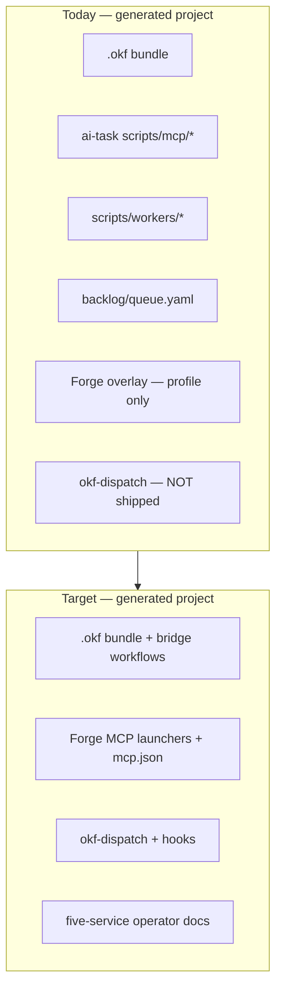

# OKF + Forge Bootstrap Alignment Plan

**Status:** Draft implementation plan  
**Owner:** bootstrap maintainers  
**Harness reference:** [nicksinx/Project-1](https://github.com/nicksinx/Project-1)  
**Last updated:** 2026-07-04

---

## 1. Goal

Make [nicksinx/bootstrap](https://github.com/nicksinx/bootstrap) generate product repositories that match the **OKF + Forge MCP ecosystem only**—the model validated in Project-1:

| Layer | Mechanism |
|-------|-----------|
| Curated memory | OKF (`.okf/`) |
| Lifecycle planning | Forge MCP portfolio + ForgeRelay |
| Implementation delivery | `scripts/okf-dispatch` |
| Research / overflow | Perplexity workflows |
| Cross-tool continuity | ForgeRelay + OKF handoffs |

**Non-goals:**

- Vendoring Forge server source into product repos
- Copying the full Project-1 integration spec into every new project
- Maintaining [cursor-ai-task-mcp-server-updated](https://github.com/nicksinx/cursor-ai-task-mcp-server-updated) as a scaffold dependency

---

## 2. Current state (gap summary)

Bootstrap is **hybrid**. The repo contains OKF dispatch and five-service docs, but **launches still ship the legacy track**.



| Area | In bootstrap repo? | Shipped on `launch_project.sh`? |
|------|-------------------|--------------------------------|
| OKF validate/handoff/context-pack | Yes (templates) | Yes |
| `okf-dispatch` | Yes (`scripts/`) | **No** — not in profile includes |
| Five-service docs | Yes (`docs/`) | **No** — not templated |
| Forge launchers | Yes (forge overlay) | Only `forge-lifecycle` profile |
| ai-task `scripts/mcp/*` | Yes (templates) | **Yes** — `default` profile |
| Worker scripts | Yes (`scripts/workers/`) | **Yes** — hardcoded copy in launcher |
| Backlog queue | Yes (templates) | Yes |

**Profile model today:** `default` (legacy-heavy) + `forge-lifecycle` (extends default, adds Forge). Full alignment requires **one canonical profile** and removal of the legacy orchestration path.

---

## 3. Decisions (resolve before Phase 1)

| ID | Decision | Recommendation | Blocks |
|----|----------|----------------|--------|
| D1 | **Backlog** — keep `backlog/` in scaffold? | **Demote:** keep optional `backlog/` for human tracking; document that **OKF dispatch is canonical** for agent delivery. Do not wire backlog to workers. | Phase 2 Makefile, validate_launch |
| D2 | **Profile names** — merge or rename? | **Merge:** single profile `default` (v2.0.0) = current `forge-lifecycle` + dispatch. Keep `legacy-task` profile one release as deprecated alias. | Phase 4 |
| D3 | **Harness material depth** — full checklists vs stubs? | **Stubs + links** to Project-1 for full promotion checklists (per `forge-lifecycle-bootstrap-lessons.md`). Ship bridge workflow + multi-agent pipeline. | Phase 5 |
| D4 | **Skills** — copy on launch or sync? | **Post-launch:** document `scripts/okf-sync-skills` in generated README; optional `--with-skills` flag on launcher. | Phase 3 |
| D5 | **Breaking change policy** | Semver bump `profile_version` to `2.0.0`; changelog + migration note for existing `legacy-task` users. | Phase 6 |

---

## 4. Phased implementation

### Phase 0 — Baseline and branch (0.5 session)

**Goal:** Freeze evidence before destructive edits.

| Step | Work |
|------|------|
| 0.1 | Run `make check` on `main`; capture passing output in `.okf/tests/bootstrap-alignment-baseline.md` (bootstrap kit) |
| 0.2 | Document current `launch_project.sh --profile default` and `--profile forge-lifecycle` file trees (before/after artifact) |
| 0.3 | Open tracking issue or handoff: "OKF+Forge-only bootstrap alignment" |

**Exit:** Baseline tests green; before-tree recorded.

---

### Phase 1 — Remove ai-task MCP track (1 session)

**Goal:** No generated project references `ai_task_orchestrator` or cursor-ai-task MCP.

| Step | Deliverable | Primary files |
|------|-------------|---------------|
| 1.1 | Delete ai-task wrapper scripts | `templates/new-project/scripts/mcp/*.sh` (7 files) |
| 1.2 | Remove from profile includes | `profiles/default.yaml` — delete `scripts/mcp/*` entries |
| 1.3 | Remove ai-task MCP config template | Delete `templates/new-project/.cursor/mcp.json.example.tmpl`; remove from `default.yaml` |
| 1.4 | Remove ai-task docs | Delete or archive `templates/new-project/docs/mcp-integration.md.tmpl`; remove from profile |
| 1.5 | Strip launcher flags | `scripts/launch_project.sh`, `scripts/standup_project.sh` — remove `--with-mcp`, `--with-mcp-config`, `MCP_SERVER_NAME` defaults for ai-task, post-launch `register_project.sh` block |
| 1.6 | Strip Makefile targets | `templates/new-project/Makefile.tmpl` — remove `mcp-health`, `mcp-register`, `mcp-import-backlog`, `mcp-sync-backlog`, `mcp-dispatch`, `mcp-review-runs`, `mcp-seed-schedules` |
| 1.7 | Rewrite generated README | `templates/new-project/README.md.tmpl` — OKF + dispatch + Forge framing |
| 1.8 | Update contract tests | `tests/test_contracts.py` — remove ai-task orchestrator fixture |
| 1.9 | Update bootstrap README | `README.md` — single-track story (no "two MCP tracks" section needed after completion) |

**Validation:**

```bash
make test-contracts
rg -i 'ai_task|ai-task-orchestrator' templates/ profiles/ scripts/launch_project.sh  # expect zero
```

**Exit:** No ai-task references in templates, profiles, or launcher; contract tests pass.

---

### Phase 2 — Remove worker orchestration track (1 session)

**Goal:** Agent delivery is not routed through `scripts/workers/*` + backlog metadata.

| Step | Deliverable | Primary files |
|------|-------------|---------------|
| 2.1 | Stop copying workers on launch | `scripts/launch_project.sh` — remove `scripts/workers/` copy loop and chmod lines |
| 2.2 | Remove worker targets from Makefile | `templates/new-project/Makefile.tmpl` — remove `worker-*`, `review-runs` (worker-based) |
| 2.3 | Update validate_launch | `scripts/validate_launch.sh` — remove `scripts/workers/*`, `scripts/lib/worker_runner.py` from `required_files` |
| 2.4 | Remove or archive worker scripts | `scripts/workers/*.sh`, `scripts/lib/worker_runner.py` — delete or move to `archive/legacy-task/` |
| 2.5 | Update standup | `scripts/standup_project.sh` — remove worker-next post hook |
| 2.6 | Replace smoke test | `tests/test_launch_smoke.py` — delete `test_worker_stub_flow`; add placeholder for dispatch smoke (Phase 3) |
| 2.7 | Rewrite agent operating model | `templates/new-project/docs/agent-operating-model.md.tmpl` — five-service roles + OKF dispatch (mirror Project-1 brief) |
| 2.8 | Update agent-workflow | `templates/new-project/docs/agent-workflow.md.tmpl` — dispatch packet flow, not worker queue |
| 2.9 | Demote backlog (D1) | Keep `backlog/` files but add note in `docs/okf-integration.md.tmpl`: optional human tracker; dispatch is delivery spine |

**Optional schema cleanup:** Mark `worker-manifest.schema.json`, `schedule.schema.json` as legacy in `schemas/` or remove from required validation if nothing references them.

**Validation:**

```bash
make test-launch-smoke  # after Phase 3 dispatch smoke added
! test -d out/demo/scripts/workers  # after launch
```

**Exit:** Launches do not create `scripts/workers/`; validate_launch does not require workers.

---

### Phase 3 — Ship OKF dispatch in scaffold (1 session)

**Goal:** Every new project gets `scripts/okf-dispatch` and can run a minimal pipeline without copying from Project-1.

| Step | Deliverable | Primary files |
|------|-------------|---------------|
| 3.1 | Template dispatch script | Copy `bootstrap/scripts/okf-dispatch` → `templates/new-project/scripts/okf-dispatch.tmpl` (or symlink-copy pattern used by okf-validate) |
| 3.2 | Template dispatch schema | Copy `Project-1/scripts/okf_dispatch_schema.py` → `templates/new-project/scripts/okf_dispatch_schema.py.tmpl` if required by okf-validate integration |
| 3.3 | Template adapter check | Copy `scripts/okf-check-adapters` → template |
| 3.4 | Template receipt helper | Copy `Project-1/scripts/okf-check-forge-receipts` → template (Forge decision promotion) |
| 3.5 | Codex hooks example | New `templates/new-project/.codex/hooks.json.tmpl` — `Stop` → `okf-dispatch advance --from codex` |
| 3.6 | Profile includes | Add to `profiles/default.yaml` (pre-merge) or new `okf-forge.yaml`: dispatch scripts, `.codex/hooks.json` |
| 3.7 | Makefile targets | Add `okf-dispatch-status`, `okf-dispatch-init` examples to `Makefile.tmpl` |
| 3.8 | validate_launch | Require `scripts/okf-dispatch`, `.codex/hooks.json` |
| 3.9 | Smoke test | `tests/test_launch_smoke.py` — `okf-dispatch status` in generated project returns 0 |
| 3.10 | okf-validate integration | Ensure templated `okf-validate` imports dispatch schema when present |

**Validation:**

```bash
./scripts/launch_project.sh --name dispatch-smoke --target-dir /tmp/dispatch-smoke --profile default --non-interactive
cd /tmp/dispatch-smoke && scripts/okf-dispatch status && scripts/okf-validate
```

**Exit:** Dispatch works in fresh launch without manual file copy.

---

### Phase 4 — Unify profiles: Forge becomes default (0.5–1 session)

**Goal:** One canonical profile; Forge MCP is not an optional overlay.

| Step | Deliverable | Primary files |
|------|-------------|---------------|
| 4.1 | Merge profile content | Fold `profiles/forge-lifecycle.yaml` `files.include` into `profiles/default.yaml` |
| 4.2 | Bump profile version | `profile_version: "2.0.0"`; update `schema` if needed |
| 4.3 | Flatten template tree | Move `templates/forge-lifecycle/**` into `templates/new-project/**`; delete overlay render branch or keep as no-op |
| 4.4 | Launcher simplification | `scripts/launch_project.sh` — always write Forge `mcp.json` from example; remove `--with-forge-mcp-config` as separate concept |
| 4.5 | Deprecation alias | `profiles/legacy-task.yaml` extends nothing; documents migration; OR `profiles/forge-lifecycle.yaml` becomes alias pointing at default with warning |
| 4.6 | project.config.yaml | Default `profile: default` (v2); document Forge sibling layout in generated config |
| 4.7 | validate_launch | Merge `forge_lifecycle_files` into `required_files` for default profile |
| 4.8 | Smoke test | Single `test_launch_and_validate` expects Forge launchers + `mcp.json` + dispatch |

**Validation:**

```bash
make check
./scripts/launch_project.sh --name aligned --target-dir /tmp/aligned --non-interactive
test -f /tmp/aligned/scripts/conceptforge-mcp.sh
test -f /tmp/aligned/.cursor/mcp.json
```

**Exit:** `default` profile produces full OKF+Forge+dispatch tree; `forge-lifecycle` name deprecated or aliased.

---

### Phase 5 — Promote operator docs and OKF concepts (1–2 sessions)

**Goal:** Generated projects match Project-1 **operator** surface (not full harness).

#### 5A — Docs (template copies from `bootstrap/docs/` and Project-1)

| File | Source |
|------|--------|
| `docs/okf-ways-of-working-brief.md` | `bootstrap/docs/` or Project-1 |
| `docs/okf-dispatch-orchestration.md` | `bootstrap/docs/` |
| `docs/create-new-okf-project-in-cursor.md` | `bootstrap/docs/` |
| `docs/create-new-okf-project-in-codex.md` | `bootstrap/docs/` |
| `docs/create-new-okf-project-in-claude.md` | `bootstrap/docs/` |
| `docs/create-new-okf-project-in-xcode.md` | `bootstrap/docs/` |
| `docs/create-new-okf-project-in-perplexity.md` | `bootstrap/docs/` |
| `docs/configure-perplexity-okf.md` | `bootstrap/docs/` |
| `docs/shared-okf-skills.md` | `bootstrap/docs/` |
| `docs/forge-lifecycle-integration.md` | existing forge template (keep) |

Add `.tmpl` wrappers where `__GENERATED_AT__` needed; add all paths to `profiles/default.yaml`.

#### 5B — OKF workflows (curated subset)

| Concept | Action |
|---------|--------|
| `.okf/workflows/okf-forge-lifecycle-bridge.md` | Copy from Project-1 (trim harness-only links) |
| `.okf/workflows/multi-agent-delivery-pipeline.md` | Copy from Project-1 |
| `.okf/workflows/perplexity-research-cycle.md` | Copy from Project-1 |
| `.okf/workflows/perplexity-overflow-failover.md` | Copy from Project-1 |
| `.okf/handoffs/README.md` | New short contract |
| `.okf/references/forge-signing-keys-operator-runbook.md` | Copy from Project-1 or slim stub |
| Promotion checklists | Keep `forge-promotion-checklists-stub.md`; link to Project-1 harness |

#### 5C — Adapter and index updates

| File | Update |
|------|--------|
| `AGENTS.md.tmpl`, `CLAUDE.md.tmpl` | Point to ways-of-working brief + bridge workflow |
| `.okf/index.md.tmpl` | Link dispatch, Forge integration, five-service docs |
| `PERPLEXITY.md` | Copy from Project-1 if not already in bootstrap |

**Validation:** `scripts/okf-validate` on generated project; manual read-order spot check.

**Exit:** Agent reading order in generated project matches Project-1 harness (index → project → task concepts → handoffs).

---

### Phase 6 — Tests, docs, and release (0.5–1 session)

| Step | Work |
|------|------|
| 6.1 | Rewrite `README.md` — single story, no legacy track |
| 6.2 | Update `new-project-standup-guide.html` if still published |
| 6.3 | Add `CHANGELOG.md` entry: **BREAKING** v2 profile — ai-task and workers removed |
| 6.4 | Add `docs/migration-from-legacy-bootstrap.md` |
| 6.5 | Update `.okf/improvements/forge-lifecycle-bootstrap-lessons.md` — close follow-ups |
| 6.6 | GitHub repo description — remove cursor-ai-task-only framing |
| 6.7 | Optional: `profiles/legacy-task.yaml` for one release with old file list (maintenance burden — decide in D2) |

**Full validation matrix:**

```bash
make check
./scripts/launch_project.sh --name v2-smoke --target-dir /tmp/v2-smoke --non-interactive
cd /tmp/v2-smoke
scripts/okf-validate
scripts/okf-dispatch status
rg -i 'ai_task|ai-task-orchestrator' .  # must be empty
test -f scripts/conceptforge-mcp.sh
test -f .cursor/mcp.json
```

**Exit:** Release tagged; README and changelog document breaking change.

---

## 5. File change matrix (summary)

| Category | Delete | Add / move | Modify |
|----------|--------|------------|--------|
| ai-task MCP | `templates/new-project/scripts/mcp/*`, `mcp.json.example`, `mcp-integration.md` | — | launcher, standup, Makefile |
| Workers | `scripts/workers/*`, worker_runner.py | — | launch_project, validate_launch, smoke tests |
| Dispatch | — | template okf-dispatch, schema, hooks | profile, Makefile, validate |
| Forge | overlay render path (after merge) | into `new-project/` tree | profile default v2 |
| Docs | agent-operating-model (rewrite) | five-service + dispatch docs | README, AGENTS, CLAUDE |
| Tests | test_worker_stub_flow | dispatch smoke | test_contracts, validate_launch |

---

## 6. Dependencies and coordination

| Dependency | Owner | Notes |
|------------|-------|-------|
| Project-1 harness | Stable dispatch + Forge evidence | Copy files from `main`; do not fork spec into bootstrap |
| ForgeLifecycleContracts pin | Forge repos | Launcher `assert-contracts-version.mjs` already in forge scripts |
| `create-new-okf-project` skill | `bootstrap/skills/` | Update `copy_optional_bootstrap_files` list after Phase 3–5 |
| Existing bootstrap users | Migration doc | `legacy-task` profile optional |

---

## 7. Effort estimate

| Phase | Sessions |
|-------|----------|
| 0 Baseline | 0.5 |
| 1 Remove ai-task | 1 |
| 2 Remove workers | 1 |
| 3 Ship dispatch | 1 |
| 4 Unify profiles | 0.5–1 |
| 5 Promote docs/OKF | 1–2 |
| 6 Release | 0.5–1 |
| **Total** | **5.5–7.5 sessions** |

Phases 1–3 are the **minimum viable alignment** (~3 sessions). Phases 4–6 complete the operator parity story.

---

## 8. Success criteria (definition of done)

- [ ] Generated project has **zero** references to `ai_task_orchestrator` or cursor-ai-task MCP
- [ ] Generated project has **no** `scripts/workers/` or `scripts/mcp/`
- [ ] Generated project includes `scripts/okf-dispatch`, Forge launchers, `.cursor/mcp.json` (Forge)
- [ ] `make check` passes on bootstrap `main`
- [ ] Fresh launch passes `scripts/okf-validate` and `scripts/okf-dispatch status`
- [ ] README describes one integration model: **OKF + dispatch + Forge (+ ForgeRelay)**
- [ ] Project-1 harness remains authoritative for full spec, promotion checklists, and E2E evidence
- [ ] Migration path documented for pre-v2 scaffolds

---

## 9. Out of scope (explicit deferrals)

| Item | Reason |
|------|--------|
| Full `docs/okf-forge-integration-spec.md` in every new project | Harness-only; link from `forge-lifecycle-integration.md` |
| All ten Forge promotion checklists in template | Stub + Project-1 links (D3) |
| Bundling Forge repo clones in launcher | `forge-clone-siblings.sh` remains optional |
| Replacing OKF with Forge | Option C unchanged |
| CI smoke against live Forge MCP servers in bootstrap `make check` | Too heavy; document sibling smokes in operator guide |

---

## 10. Related material

- [Project-1 integration spec](https://github.com/nicksinx/Project-1/blob/main/docs/okf-forge-integration-spec.md)
- [forge-lifecycle-bootstrap-lessons.md](../.okf/improvements/forge-lifecycle-bootstrap-lessons.md)
- [bootstrap README](../README.md)
