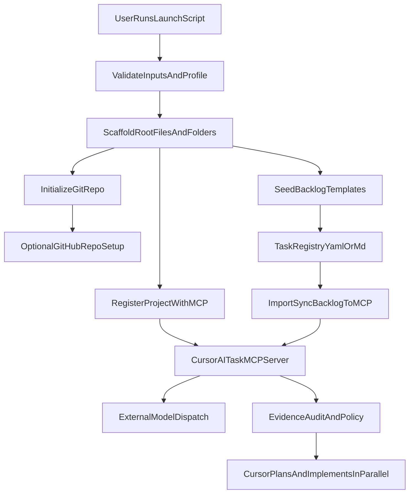

# Reusable Project Launch System Plan

## Core Decision
- Do not make Bash worker scripts the primary AI execution engine.
- Launcher should create MCP-ready projects deterministically.
- MCP server should own task execution, scheduling, model dispatch, evidence packs, audit logs, and review state.
- Cursor remains the interactive planning/review/approval surface for final code application.

## MCP Baseline Reality Check (Reviewed)
- Current MCP server implementation is an HTTP scaffold with minimal endpoints, not a full MCP tool/resource surface yet.
- Existing implemented routes are limited to:
  - `POST /api/task/create`
  - `GET /api/events`
  - `GET /api/health`
- Event vocabulary is broadly defined, but most lifecycle/policy/schedule/evidence handlers are still declarative.
- Plan execution must treat MCP capability as phased buildout from this scaffold rather than an already-complete orchestration fabric.

## Skill Routing Matrix
- `software-engineering-orchestrator`: route phase ownership, sequence work, and keep handoffs traceable.
- `change-plan-task-slicer`: split each phase into atomic, low-risk implementation tasks.
- `safe-code-generator-refactoring-engineer`: implement shell scripts and file scaffolding safely.
- `test-strategy-composer`: define the minimum automated + manual validation portfolio.
- `threat-model-secure-review`: review worker execution, command boundaries, and secret handling.
- `supply-chain-release-gate`: determine ship readiness from evidence and rollback posture.
- `github-repo-manager`: optional reference only if separately installed; default GitHub bootstrap remains launcher-owned.
- `observability-slo-incident-improvement-engineer`: define run telemetry and failure runbook requirements.

## Goals
- Create a reusable launcher that can initialize a new project from a template profile.
- Standardize root artifacts (docs, env examples, automation scripts, backlog structure).
- Support optional GitHub repository creation and setup.
- Create a repeatable local backlog with task definitions that can be executed by background Codex/Claude worker scripts while Cursor continues interactive work.

## Design Principles (Long-Lived Reuse)
- Determinism first: identical inputs produce identical scaffold output, logs, and queue state.
- Explicit contracts over conventions: every script interface, artifact schema, and run status is documented.
- Idempotency as a hard requirement: reruns converge, never duplicate, and never silently drift.
- Composable defaults: base profiles are stable; overlays are additive and conflict-checked.
- Safe by default: no secret persistence, no destructive git operations, no implicit network side effects.

## Architecture (Bash + Makefile)

## Responsibility Split
- Project scaffold: Launcher
- GitHub bootstrap: Launcher
- Local backlog seed: Launcher
- Project registration and backlog import: Launcher calls MCP
- Task execution and scheduled runs: MCP server
- Model provider selection and dispatch: MCP server
- Evidence packs and audit logs: MCP server
- Human review and approval: Cursor
- Final code application and release approval: Cursor / human

## Phase 1: Bootstrap Framework
- Add `scripts/launch_project.sh` as the single entry point.
- Define an explicit CLI contract:
  - `--name`
  - `--profile`
  - `--with-github`
  - `--dry-run`
  - `--non-interactive`
- Define stable exit codes:
  - `0` success
  - `2` input validation failure
  - `3` dependency missing
  - `4` GitHub setup failure
  - `5` worker bootstrap failure
- Add a launch lock (`.launch.lock`) to prevent concurrent bootstrap runs in the same project path.
- Add `Makefile` targets for common lifecycle actions:
  - `make launch` (project bootstrap)
  - `make backlog-init` (seed backlog)
  - `make worker-start` (start selected background worker)
  - `make worker-status` and `make worker-stop`
  - `make validate-launch` (run deterministic validation checks)
  - `make release-gate` (evaluate launch evidence and ship/no-ship posture)
- Add profile-driven defaults (e.g., `profiles/default.env`) so future projects can reuse one launcher with different presets.
- Define profile precedence rules: CLI flags > environment variables > profile overlay > base profile defaults.
- Add compatibility mode flags for future versions:
  - `--profile-version`
  - `--compat-mode` (strict, warn, legacy)
- Add MCP integration flags:
  - `--with-mcp`
  - `--with-mcp-config`
  - `--mcp-server-name`
  - `--mcp-transport` (`stdio|http`)
  - `--mcp-command`
  - `--mcp-url`
  - `--mcp-data-dir`
  - `--mcp-project-id`
  - `--mcp-register-only`
  - `--mcp-seed-schedules`
  - `--mcp-auth-profile` (`none|local-token|mtls|oauth`)
  - `--mcp-token-source` (`env|keychain`)
- Extend stable exit codes:
  - `6` MCP registration failure
  - `7` MCP config generation failure
  - `8` MCP schedule seeding failure
  - `9` validation failure
  - `10` unsafe operation blocked
- Add MCP server alignment task before integration:
  - implement MCP-native tool/resource contract (or explicitly codify HTTP bridge mode)
  - remove transport ambiguity between `.cursor/mcp.json` expectations and server runtime mode
  - block project registration automation until transport contract is verified end-to-end

## Phase 2: Root File Scaffolding
- Create a deterministic scaffold function in `scripts/launch_project.sh` that writes baseline files only when absent (idempotent behavior).
- Baseline files/folders to generate:
  - `README.md`
  - `.gitignore`
  - `.env.example`
  - `docs/` (with architecture + runbook placeholders)
  - `backlog/` (task specs and queue)
  - `scripts/workers/` (agent runner scripts)
- Keep project-specific values in one config file (`project.config.env`) to avoid hardcoded values across scripts.
- Add ownership metadata for each generated artifact:
  - `generated_by=launch_project`
  - `template_version=<semver>`
  - `generated_at=<timestamp>`
- Add protected sections for user-editable files (e.g., `README.md`) to prevent clobbering manual edits during reruns.
- Add MCP-ready project artifacts:
  - `.cursor/mcp.json.example` generated by default
  - `.cursor/mcp.json` generated only when `--with-mcp-config` is explicitly provided
  - `docs/mcp-integration.md` and `docs/agent-operating-model.md`
  - machine-readable backlog state at `backlog/queue.yaml` for MCP import/sync

## Phase 3: GitHub Repository Automation
- Add `scripts/github_init.sh` that:
  - validates `gh` auth
  - creates repo (private/public flag)
  - adds origin remote
  - pushes initial commit
  - optionally enables issue templates/labels
- Keep this step optional via `--with-github` flag in launcher.
- Capture outcomes in `logs/bootstrap.log` for repeatability and troubleshooting.
- Add branch strategy defaults:
  - default branch naming policy
  - protected-branch recommendation output
  - optional CODEOWNERS/bootstrap labels for consistency across projects
- Add remote safety checks:
  - detect existing remotes and require explicit confirmation before overwrite/mutation
  - no force push behavior in bootstrap path

## Phase 4: Repeatable Local Backlog System
- Define backlog data model in markdown + metadata:
  - `backlog/tasks/*.md` as task specs (goal, inputs, done criteria, agent preference)
  - `backlog/queue.yaml` as machine-readable prioritized queue state
  - `backlog/templates/task.template.md` for new task generation
- Include a `schema_version` field in task metadata to enable future migrations safely.
- Include seeded task categories:
  - project setup
  - code quality
  - docs
  - testing
  - release readiness
- Add `scripts/backlog_seed.sh` to regenerate canonical starter tasks safely.
- Extend task metadata schema:
  - `task_id`
  - `priority` (P0-P3)
  - `risk` (low, medium, high)
  - `depends_on` (task ids)
  - `required_skills` (routing hints)
  - `verification_type` (automated, manual, hybrid)
- Add queue invariants:
  - no duplicate `task_id`
  - no cycles in `depends_on`
  - blocked tasks cannot be dispatched

## Phase 5: Background Agent Runner Scripts
- Re-scope this phase to MCP wrappers first (not direct Codex/Claude runners):
  - `scripts/mcp/register_project.sh`
  - `scripts/mcp/import_backlog.sh`
  - `scripts/mcp/sync_backlog.sh`
  - `scripts/mcp/dispatch_task.sh`
  - `scripts/mcp/review_runs.sh`
  - `scripts/mcp/seed_schedules.sh`
  - `scripts/mcp/health_check.sh`
- Keep direct worker scripts as optional offline fallback, not the default execution path.
- Add two worker wrappers:
  - `scripts/workers/run_codex_task.sh`
  - `scripts/workers/run_claude_task.sh`
- Each wrapper should:
  - accept task file path + run id
  - write output to `runs/<agent>/<run-id>/`
  - write a run manifest to `runs/<agent>/<run-id>/manifest.json`
  - persist pid + status in `runs/status/`
  - support `start/status/stop` operations
- Add runtime hardening:
  - per-task timeout and bounded retries with backoff
  - allowlisted command execution paths only
  - input path sanitization for task/context references
- Add `scripts/workers/dispatch_task.sh` to route tasks by agent preference from backlog metadata.
- Ensure workers are non-blocking (`nohup` or background process) so Cursor can continue foreground planning/implementation.
- Default worker policy: never mutate git state (no commits/pushes) unless an explicit opt-in flag is provided.
- Add concurrency controls:
  - max workers per agent
  - max global workers
  - queue lease timeout and stale PID recovery
- Add artifact integrity checks:
  - ensure required output files exist before marking task complete
  - fail task if manifest/checklist is incomplete

## Phase 6: Cursor-Compatible Workflow Contract
- Define a lightweight handoff contract for agents:
  - input: task markdown + context paths
  - output: result markdown + suggested diffs + validation checklist
- Add `docs/agent-workflow.md` with rules:
  - background workers never auto-commit
  - workers produce artifacts for review
  - Cursor remains orchestrator for final edits/merge decisions
- Add a `make review-runs` command to summarize recent background outputs for quick ingestion.
- Add explicit handoff schema (versioned):
  - `input.schema_version`
  - `input.task`
  - `input.context`
  - `output.summary`
  - `output.proposed_changes`
  - `output.verification`
  - `output.blockers`
- Define quality thresholds for handoff acceptance:
  - no unresolved critical blockers
  - verification checklist complete
  - referenced file paths must exist

## Phase 7: Safety, Idempotency, and Extensibility
- Implement guardrails in all scripts:
  - fail-fast with clear messages
  - required dependency checks (`gh`, `git`, agent CLIs)
  - idempotent file writes and repo setup checks
- Add a dry-run mode (`--dry-run`) to print actions without changes.
- Add secrets policy:
  - read credentials from env only
  - redact tokens from logs
  - never persist secrets to generated project files
- Add extension points:
  - optional post-launch hooks in `scripts/hooks/*.sh`
  - profile overlays for language/runtime-specific additions
- Add `template_version` to `project.config.env` so scaffold evolution is explicit and traceable.
- Add portability notes for macOS/Linux shell differences (BSD vs GNU tooling) in script conventions.
- Add migration policy:
  - semantic versioning for templates and schema
  - `scripts/migrate_project.sh --from X --to Y`
  - dry-run migration reports before write operations
- Add MCP safety boundaries:
  - strict project scoping per tool/resource call
  - approval policy enforcement for repo writes and external notifications
  - scheduled repo mutation forbidden by default
  - immutable audit events for all policy decisions
- Add MCP security hardening gates based on reviewed server state:
  - require authn/authz for all task/event endpoints before non-readonly execution features ship
  - remove or restrict global event listing (`GET /api/events`) to avoid cross-project leakage
  - require persistent event storage (not in-memory only) before claiming audit durability

## Validation Strategy
- Automated checks (`scripts/validate_launch.sh`):
  - verify scaffolded files/folders and expected baseline content shape
  - verify idempotent rerun behavior (no duplicate/unstable artifacts)
  - verify optional GitHub path behavior (enabled/disabled)
  - verify MCP wrapper health, registration path, and backlog import/sync contracts
  - verify optional worker fallback output contract (status + manifest + output artifacts)
- MCP-specific preflight checks (must pass before enabling task execution by default):
  - transport compatibility check (`stdio` vs HTTP bridge mode) for configured MCP server
  - auth check for protected MCP operations
  - project isolation test (no cross-project event/task visibility)
  - policy enforcement check for approval-required operations
  - persistence check for events/evidence/audit records across server restarts
- Manual smoke tests:
  - launch into empty directory
  - relaunch in initialized directory (verify idempotency)
  - run with/without GitHub step
  - enqueue and dispatch one Codex + one Claude task concurrently
- Add `make test-launch` to run automated validation in local and CI contexts.
- Success criteria:
  - project scaffold reproducible in under 2 minutes
  - all generated paths/files deterministic
  - background task outputs captured with run metadata
  - no blocking of Cursor interactive flow
- Add non-functional quality gates:
  - bootstrap p95 runtime budget (e.g., <= 120s on baseline hardware)
  - worker completion SLO (e.g., 95% tasks complete without manual intervention)
  - error-budget threshold that triggers stabilization before new features

## Release Gate
- Require evidence bundle before rollout:
  - launch logs, validation output, worker manifest completeness, and dependency/security checks
- Decision policy:
  - `pass`: all required checks/evidence complete
  - `pass-with-exceptions`: non-critical gaps documented with owner + due date
  - `fail`: critical checks missing, unsafe defaults, or non-reproducible behavior
- Rollback readiness:
  - clear cleanup steps for partial bootstrap
  - safe re-run path from failed intermediate state
  - documented operator runbook for common failure classes

## Five Additional Refinement Passes

### Pass 1: Governance and Scope Control
- Add `docs/governance.md` that defines maintainers, review ownership, and decision boundaries for launcher changes.
- Require ADR-style records for changes to launcher contract, backlog schema, or worker policy.
- Introduce "breaking-change checklist" for compatibility-impacting updates.

### Pass 2: Contract and Schema Formalization
- Define machine-readable schema files:
  - `schemas/profile.schema.json`
  - `schemas/task.schema.json`
  - `schemas/worker-manifest.schema.json`
- Validate generated artifacts against schema during `make validate-launch`.
- Fail fast when schema versions are incompatible unless `--compat-mode=legacy` is explicitly set.

### Pass 3: Reliability and Observability
- Add structured logging format (`jsonl`) for bootstrap and worker runs.
- Standardize run correlation fields:
  - `run_id`
  - `project_id`
  - `task_id`
  - `agent`
  - `phase`
- Add `docs/runbook.md` with triage flows for bootstrap failures, worker hangs, and queue deadlocks.

### Pass 4: Security and Trust Boundaries
- Classify trust zones:
  - launcher host environment
  - generated project filesystem
  - external services (`gh`, remote APIs)
  - agent CLI invocation boundary
- Explicitly deny unsafe patterns:
  - unbounded shell interpolation
  - unvalidated path execution
  - secret echo in stdout/stderr
- Require threat review before enabling any new external integration in bootstrap scripts.

### Pass 5: Adoption, Upgrade, and Lifecycle
- Add support matrix documentation (`docs/support-matrix.md`) for OS, shell, and tool versions.
- Define deprecation lifecycle:
  - announce in `CHANGELOG.md`
  - support window
  - migration guide and cutoff date
- Add "golden template" snapshot tests to ensure future edits do not break prior project baselines.

## Implementation Milestones and Checkpoints
- Milestone A (contracts): CLI, schemas, and profile precedence locked with tests.
- Milestone B (core bootstrap): scaffold + GitHub + backlog seeding stable and idempotent.
- Milestone C (MCP integration): project registration, backlog import/sync, dispatching, and evidence/audit flows proven.
- Milestone D (operations): observability, runbooks, and release gate producing reliable evidence.
- Milestone E (lifecycle): migration tooling and backward compatibility validated on older projects.
- Milestone C.0 (MCP foundation hardening, required before C):
  - replace or wrap minimal HTTP scaffold with MCP-aligned tool/resource surface
  - enforce authn/authz and project isolation for all endpoints/tools
  - implement durable event/evidence/audit persistence
  - close transport mismatch with `.cursor/mcp.json` configuration mode

## What Remains (Owner Labels)
- in-repo:
  - expand worker smoke coverage (stop/status/review edge cases)
  - optional jsonl log sink unification across all helper scripts
  - template snapshot/golden tests for drift detection
- external:
  - MCP server authn/authz enforcement for protected operations
  - MCP project isolation verification and policy gate enforcement
  - durable event/evidence persistence across server restarts

## Initial File Targets
- New files to create:
  - `/Users/dv/projects/Codex/autonomous-ideas-signals/scripts/launch_project.sh`
  - `/Users/dv/projects/Codex/autonomous-ideas-signals/scripts/github_init.sh`
  - `/Users/dv/projects/Codex/autonomous-ideas-signals/scripts/backlog_seed.sh`
  - `/Users/dv/projects/Codex/autonomous-ideas-signals/scripts/mcp/register_project.sh`
  - `/Users/dv/projects/Codex/autonomous-ideas-signals/scripts/mcp/import_backlog.sh`
  - `/Users/dv/projects/Codex/autonomous-ideas-signals/scripts/mcp/sync_backlog.sh`
  - `/Users/dv/projects/Codex/autonomous-ideas-signals/scripts/mcp/dispatch_task.sh`
  - `/Users/dv/projects/Codex/autonomous-ideas-signals/scripts/mcp/review_runs.sh`
  - `/Users/dv/projects/Codex/autonomous-ideas-signals/scripts/mcp/seed_schedules.sh`
  - `/Users/dv/projects/Codex/autonomous-ideas-signals/scripts/mcp/health_check.sh`
  - `/Users/dv/projects/Codex/autonomous-ideas-signals/scripts/workers/run_codex_task.sh`
  - `/Users/dv/projects/Codex/autonomous-ideas-signals/scripts/workers/run_claude_task.sh`
  - `/Users/dv/projects/Codex/autonomous-ideas-signals/scripts/workers/dispatch_task.sh`
  - `/Users/dv/projects/Codex/autonomous-ideas-signals/backlog/queue.yaml`
  - `/Users/dv/projects/Codex/autonomous-ideas-signals/backlog/templates/task.template.md`
  - `/Users/dv/projects/Codex/autonomous-ideas-signals/docs/agent-workflow.md`
  - `/Users/dv/projects/Codex/autonomous-ideas-signals/docs/mcp-integration.md`
  - `/Users/dv/projects/Codex/autonomous-ideas-signals/docs/agent-operating-model.md`
- Existing files likely to extend:
  - [`/Users/dv/projects/Codex/autonomous-ideas-signals/Makefile`](/Users/dv/projects/Codex/autonomous-ideas-signals/Makefile)
  - [`/Users/dv/projects/Codex/autonomous-ideas-signals/.env.example`](/Users/dv/projects/Codex/autonomous-ideas-signals/.env.example)
  - [`/Users/dv/projects/Codex/autonomous-ideas-signals/README.md`](/Users/dv/projects/Codex/autonomous-ideas-signals/README.md)
